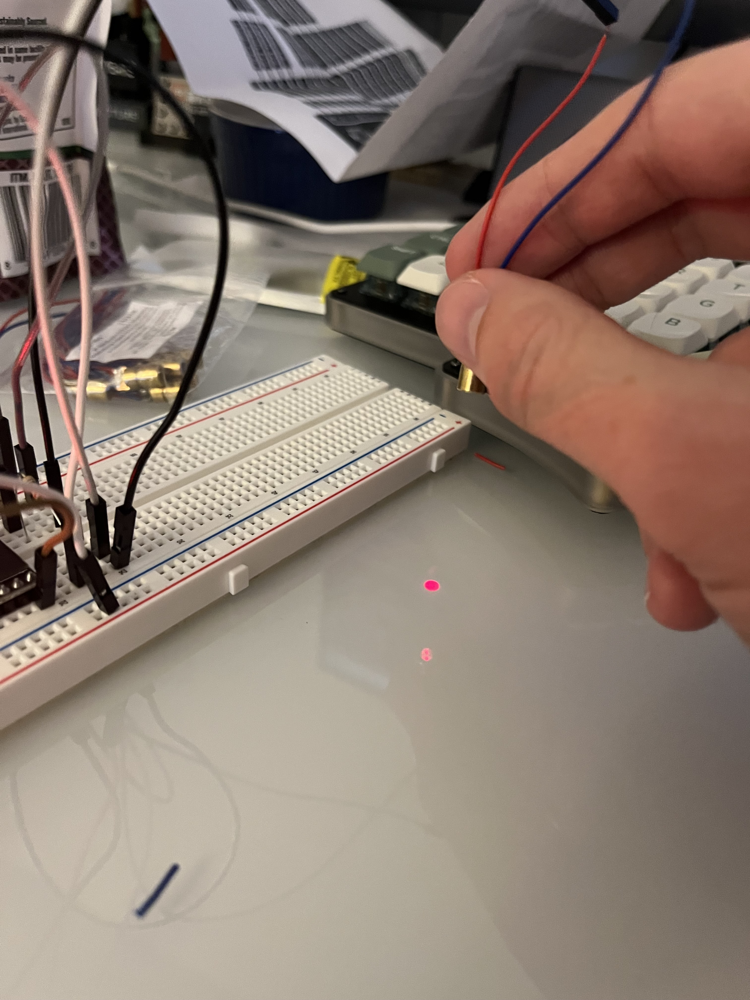

# BKLP (Better Kitty Laser Pointer)

BKLP is a better laser pointer that I built myself. Did it cost more than 6
times as much as a basic auto laser toy? Yes, it did. However, it is fun, the
microcontrollers and motors I've bought have way more control over movement, and
I can (theoretically) start and modify patterns from my phone!

## Current Status

I've wired up the lasers and played with different resistors to find one that
gives a bright enough laser without burning out the diode. I ended up using a 65
&Omega; resistor, which comes from the following calculations using Ohm's
Law[^1]:

R = (Vsupply - Vforward) / I[^2]

R = (3.3V - 2.5V) / 0.015 I

R = 53.3333333333 &Omega;

[^1]: From what I can find online, diodes are funky and don't actually follow
    regular ol' Ohm's Law of V=IR. I do not pretend to understand. My laser
    turns on, is bright but not too bright, and doesn't burn out.

[^2]: The supply voltage comes from the ESP32 datasheet, while the forward
    voltage is Claude's WAG on the forward voltage of a laser diode. There are
    equations to correlate laser diode wavelength to forward voltage drop but it
    depends on lots of variables, like temperature, noise from power supplies,
    tolerances, etc, so 2.5V works well enough. The diodes I bought didn't come
    with a datasheet, at least not one I can find linked on the Amazon listing
    or anywhere online, though I haven't looked very hard yet.

I still need to wire up the motors and get them working. The basic code I have
in this repository is just for turning the laser on and off. Here's the pinning
that I have on a breadboard, though I'm not sure how helpful it will be:

And look ma, it does the thing!

## Running the Code

After setting things up and wiring things for whatever you're testing, you can
use the
[VSCode Arduino](https://marketplace.visualstudio.com/items?itemName=vscode-arduino.vscode-arduino-community)
extension or the Arduino IDE (which just looks like a closed-source fork of
VSCode tbh). The best set-up I've found so far is using Copilot in VSCode for
help/questions/code writing, then using the actual IDE whenever you need to
upload or get libraries or whatever. Works much better that way, annoying though
it is.

## Parts List

I got all of my parts off of Amazon.

### Microcontroller

[This](https://www.amazon.com/dp/B0CNYK7WT2?ref=ppx_yo2ov_dt_b_fed_asin_title)
is a basic ESP32 microcontroller with Bluetooth and WiFi and it works through
the Arduino IDE/VSCode extension. I _think_
[this](https://documentation.espressif.com/esp32_datasheet_en.pdf) is a valid
datasheet that should work. Here's a pinout diagram from the Amazon page:

### Laser Diode

[These](https://www.amazon.com/dp/B071FT9HSV?ref=ppx_yo2ov_dt_b_fed_asin_title)
are some basic red laser diodes. I haven't found a datasheet for them. I'm
running them with a 65 Ohm resistor at whatever the output voltage for a GPIO
pin on an ESP32 is (roughly 3.3V from what I can tell).

### Wires

You'll need wires. I just got
[these](https://www.amazon.com/dp/B01EV70C78?ref=ppx_yo2ov_dt_b_fed_asin_title)
DuPont wires. It's got MtM, MtF, and FtF.

### Resistors

I got
[this](https://www.amazon.com/dp/B08FD1XVL6?ref=ppx_yo2ov_dt_b_fed_asin_title&th=1)
giant pack of resistors cause I wasn't sure what I'd need for the motors and
diodes and figured I could use resistors for whatever future projects I do.

### Breadboard

Get any breadboard you want. I got
[these](https://www.amazon.com/dp/B01EV6LJ7G?ref=ppx_yo2ov_dt_b_fed_asin_title).

### Motors & Motor Brackets

As recommended in a random midnight discussion with Claude, I'm using some SG90
motors. They (supposedly) can be driven by the microcontroller, though I haven't
tested that yet. I got
[this big pack](https://www.amazon.com/dp/B0DJ9FYCML?ref=ppx_yo2ov_dt_b_fed_asin_title&th=1).

You'll also want an easy way to tilt & pan the laser. I just looked for any tilt
& pan mounts that would work with SG90 motors and ended up with
[these](https://www.amazon.com/dp/B0DJ9FYCML?ref=ppx_yo2ov_dt_b_fed_asin_title&th=1).
